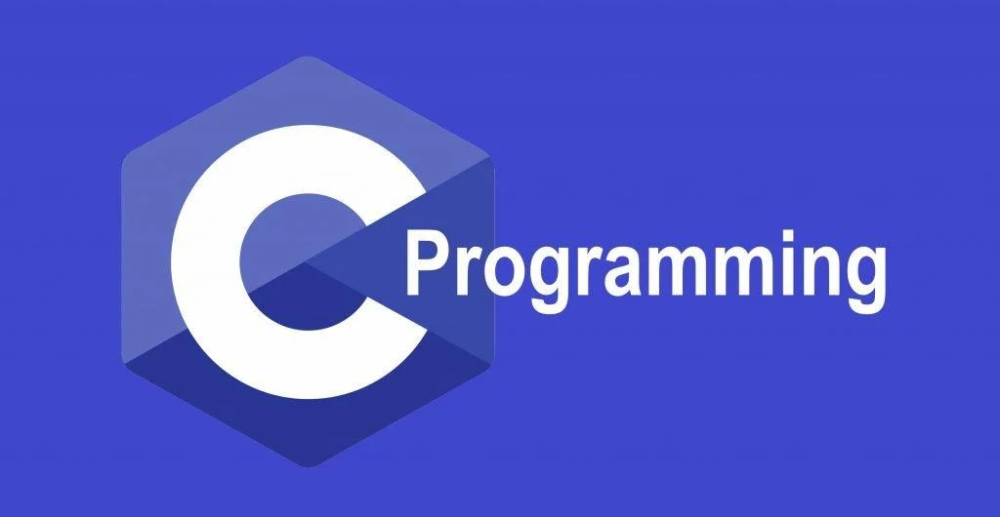

  
  

 
  <h1 align="center">C Programming Learning Repository</h1>
  
  

  <h2 align="center">C Programming Projects</h2>

Welcome to my C programming learning repository! This repository contains various programs and projects implemented in C to enhance programming skills.

## 
## Project Documentation

### 1. Voting System

- Description: A program to simulate a voting system.
- Blog Post: [Voting System](https://codeaashu.hashnode.dev/building-a-voting-system-in-c)

### 2. Student Grade System

- Description: A program to track and manage student grades.
- Blog Post: [Student Grade System](https://codeaashu.hashnode.dev/building-a-student-grade-tracker-in-c)

### 3. Snake Game

- Description: Implementation of the classic Snake game.
- Blog Post: [Snake Game](https://codeaashu.hashnode.dev/creating-a-simple-snake-game-in-c)

### 4. OTP Login System

- Description: A secure login system using OTP authentication.
- Blog Post: [OTP Login System](https://codeaashu.hashnode.dev/building-an-otp-based-login-system-in-c)

### 5. Number Guessing Game

- Description: A simple number guessing game.
- Blog Post: [Number Guessing Game Blog Post](https://sudeep449.hashnode.dev/building-a-number-guessing-game-in-c)

### 6. Library Management System

- Description: A program to manage library resources.
- Blog Post: [Library Management System Blog Post](https://sudeep449.hashnode.dev/building-a-library-management-system-in-c)

### 7. File Compression Utility

- Description: Implementation of a file compression utility using algorithms like Huffman coding or Run-Length Encoding.
- Blog Post: [File Compression Utility Blog Post](https://sudeep449.hashnode.dev/understanding-huffman-coding-in-c)

### 8. DBMS Software

- Description: A basic database management system.
- Blog Post: [DBMS Software Blog Post](https://sudeep449.hashnode.dev/simple-database-management-in-c)

### 9. Banking Management System

- Description: A program to manage banking operations like account creation, transactions, etc.
- Blog Post: [Banking Management System Blog Post](https://sudeep449.hashnode.dev/title-building-a-basic-banking-system-in-c)

### 10. Authentication System

- Description: A user authentication system.
- Blog Post: [Authentication System Blog Post](https://sudeep449.hashnode.dev/basic-user-authentication-system-in-c)

## Usage

To run these programs, you can compile them using a C compiler like GCC and execute the generated binaries.
